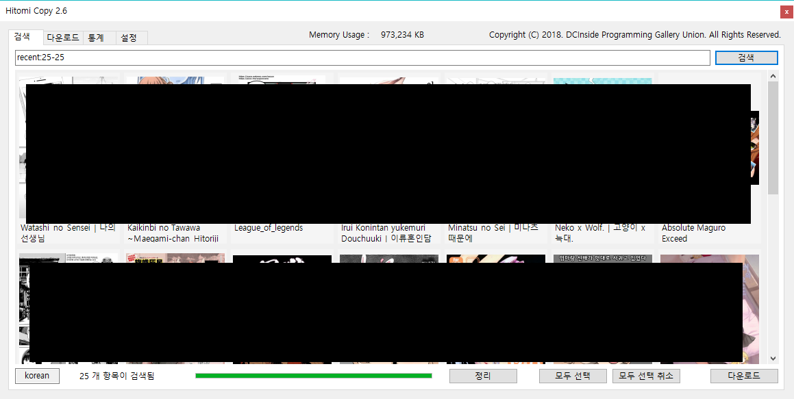
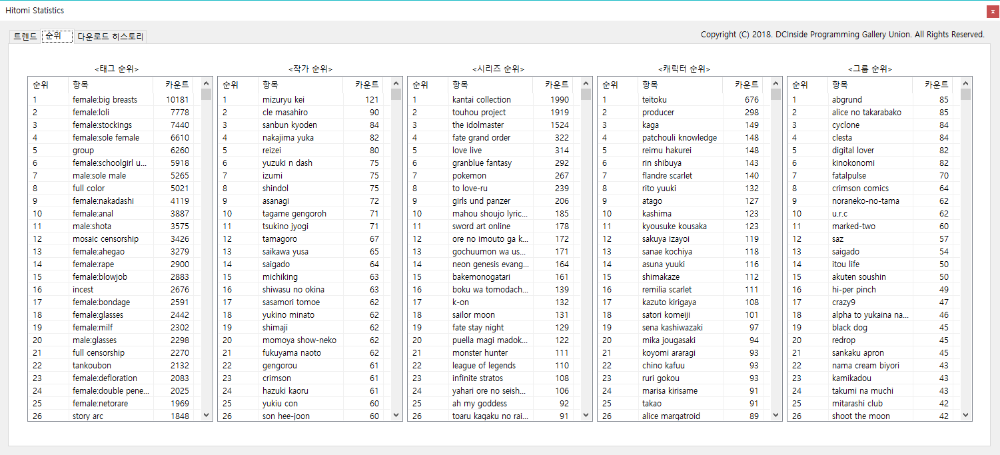

# Hitomi Copy (현존하는 최강의 히토미 다운로더)

소스코드는 Hitomi Copy 2 폴더에 있습니다.

# 다운로드 주소

https://github.com/dc-koromo/hitomi-downloader-2/releases/tag/2.7a 여기서 새로운 버전을 다운받으세요.

# 오류

## .NET Framework가 설치되지 않음
프로그램은 처음시작할때 오류가 난것이라면, `.NET Framework`가 설치되지 않은 경우일 확률이 매우 높습니다.
https://www.microsoft.com/ko-kr/download/details.aspx?id=49982
여기서 최신버전의 `.NET Framework`를 받거나 `Windows` 운영체제를 업데이트 하세요.


# 핵심 기능

## 초기창


프로그램을 처음시작하면 데이터 다운로드가 시작됩니다. 
히토미 접속 트래픽이 증가할 경우 다운로드 속도가 매우 느릴 수 있으니 몇 분 정도 기다려 주세요.

## 검색




히토미 다운로더의 핵심 기능인 검색창 입니다. 이미지에 예제를 보고 아래 설명을 참고해주세요.
```
1. tag:, artist:, series:, group:, character:, tagx:를 이용해 상세검색을 할 수 있습니다. (tagx는 포함하지 않을 태그)
2. ':'가 없는 단어를 입력하면 알아서 찾습니다.
3. 123456 789456 이런식으로 히토미 번호를 넣어주면 알아서 찾아검색창에 뿌려줍니다.
4. 모든 단어는 스페이스로 구분됩니다.
5. 스페이스가 포함된 검색어는 '_'문자를 대신 넣어주세요(ex tag:female:sex_toys)
6. recent:<시작항목>-<불러올개수> 를 입력하면 데이터베이스를 기준으로 정렬된 데이터를 가져옵니다. 
(2.4 버전부터 프로그램 시작시 기능이 제공됩니다. "검색"버튼을 누를때 마다 <시작항목>이 업데이트 됩니다. <시작항목>이 없을 경우 처음부터 <불러올개수>만큼 불러옵니다.)
```

# 데이터 분석


최신 빅데이터 분석 알고리즘으로 당신의 취향에 맞는 작가를 추천해 드립니다!


`통계`탭을 누르시면 기존의 다운로드 기록을 바탕으로 작가를 추천해드립니다.


또한 현재 베타 기능이긴하지만, 작품도 추천해드립니다.
다만, 태그가 하나인 게시물들이 상위에 많이 존재할 수 있습니다.
이것은 기술적으로 해결할 수가 없었습니다 ㅠㅠ


`통계` 탭에서 `통계`버튼을 눌러 보세요.
최근 1년 정도의 데이터를 한눈에 볼 수 있는 기능을 제공합니다.
제공되는 데이터 유형은 다음과 같습니다.
```
작품 업로드 변동 폭
작품 업로드 누적 폭
태그 누적
태그 누적 - 한국어
태그 변동 - 한국어
작가 작품 수 누적
작가 작품 수 누적 - 한국어
작가 작품 수 변동 - 한국어
그룹 누적 - 한국어
그룹 변동 - 한국어
시리즈 누적 - 한국어
시리즈 변동 - 한국어
캐릭터 누적 - 한국어
캐릭터 변동 - 한국어
```



물론 정적인 데이터 분석결과도 필요하겠죠. 그래서 대충 구겨넣었습니다. 어차피 안쓰실거예요!


다운로드 히스토리도 형식적으로라도 보여줘야겠죠?


`설정`탭에 가시면 데이터 동기화 및 다운로드 경로, 제외할 태그들을 입력할 수 있습니다.

# FAQ

## 검색된 항목이 많아 표시할 수 없습니다.

통계탭=>검색을 통해 이미지를 불러오지 않는 검색을 활용해보세요. 이 검색창은 통합검색과 같은 결과를 보여줍니다.

## 디스크 드라이브 용량이 생각보다 많이 증가한 것 같나요?

Ctrl+R를 누르시고, %temp% 입력후 해당 폴더의 모든 항목을 삭제하세요. 또는 디스크 정리유틸리티를 사용해보시기 바랍니다.

## 어디에 제 다운로드가 저장되나요?

기본 다운로드 경로는 `설정`탭에서 설정할 수 있습니다.

## 한국어 이외의 다른 언어로 검색하고 싶습니다.

이 프로그램은 language:korean만 검색할 수 있습니다. 기타 언어에 대해선 소스코드의 모든 "korean"을 "japanese"로 바꾸는 등의 작업을 수행해야 합니다.
만약 수정이 불가능한 경우(프로그래밍을 할 수 없는 경우) github회원가입후 issues란에 관련사항을 요청해주시기 바랍니다.

## 마루마루 다운로더는 언제만드나요?

이번달 안에 만들예정입니다.

## 파일이 자주 깨집니다.

`Issues`란에 깨진 경위를 설명해주시면 적절히 업데이트 하겠습니다.

## 누가 이 프로그램을 만든건가요?

제가 만들었습니다.


# TODO

 * 작가 추천 서비스를 데이터 분석 전문 라이브러리를 이용해 전문화 시킬 계획입니다. (로그 기록을 분석하는 것이 아닌 작가 추천 프로그램을 완전히 새로 만들 계획입니다.)

 * 마루마루 다운로더를 만들 예정입니다. (많은 분들이 전문화된 마루마루 다운로드 도구를 요구하였기에 다운로더를 만들 계획이 있습니다.)

 * 이헨, 익헨 다운로드 기능이 곧 추가됩니다.

 * 히토미 뷰어가 곧 추가됩니다.

 * Zip 압축 기능이 곧 추가됩니다.

 * 범용 이미지 다운로더를 만들 예정입니다. (트위터, 텀블러, 등)

 * Hiyobi.me 태그를 바탕으로 한글 태그를 추출할 예정입니다.

 * 히토미 복사 기능이 추가될 예정입니다. 

    프로그램 이름에서 보듯이 Hitomi Copy는 히토미 서버를 통채로 복사하기 위해 만든 프로그램이었습니다. 

    좀더 섬세한 작업 기능을 추가하고 복사 기능을 지원할 예정입니다.

 * 작가 동기화 기능이 추가될 예정입니다. (작가 동기화 기능은 특정 작가의 업데이트 상태를 알려줍니다.)

 * Nozomi.la, rule34 등 이미지 업로드 사이트 다운로더를 만들계획입니다.
